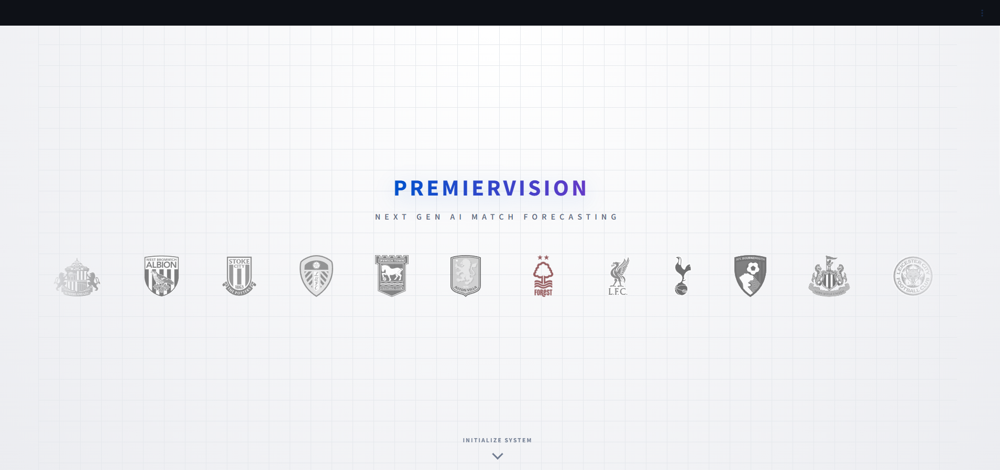
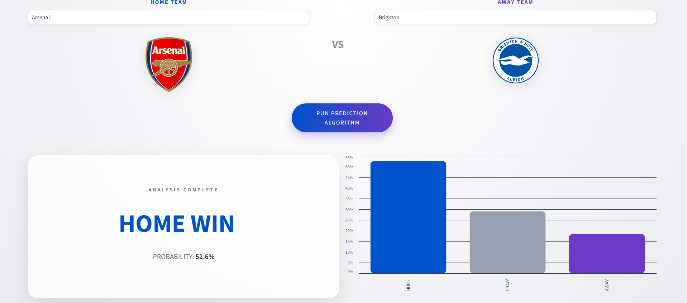

# PremierVision EPL Predictor

[](https://www.python.org/)
[](https://streamlit.io/)
[](https://www.tensorflow.org/)
[](https://opensource.org/licenses/MIT)

PremierVision is a Streamlit web app that predicts EPL match outcomes (Home Win, Draw, Away Win) using a trained TensorFlow model.

## Why This Project

- Interactive EPL matchup prediction with a clean UI.
- Stable outputs for repeated runs with the same input matchup.
- Input features are generated from real season-level team statistics.
- Ready to run locally with a simple Python setup.

## Tech Stack

- Python
- Streamlit
- TensorFlow / Keras
- Pandas and NumPy
- Altair

## Project Structure

- app.py: Main Streamlit application
- epl_final.csv: EPL dataset used for statistics and feature engineering
- epl_model.keras: Trained model artifact
- scaler.pkl: Saved scaler artifact from model training workflow
- requirements.txt: Python dependencies
- .gitignore: Git ignore rules
- assets/images/: Project screenshots folder
- SOCIAL_PREVIEW_CANVA.md: Ready-to-use social preview design guide

## Project Preview





## How Predictions Work

1. You select season, home team, and away team.
2. Team profiles are built from season stats:
	 goals, shots, shots on target, corners, fouls, yellow cards, red cards, and points per match.
3. Profiles are converted to a 36-feature vector to match the model input shape.
4. The model returns probabilities for Away Win, Draw, and Home Win.

## Run Locally

```powershell
python -m venv .venv
.\.venv\Scripts\Activate.ps1
pip install -r requirements.txt
python -m streamlit run app.py
```

## Portfolio Polish Checklist

- Add a repo description:
	AI-powered EPL outcome prediction app built with Streamlit and TensorFlow.
- Add topics:
	streamlit, tensorflow, machine-learning, football, premier-league, sports-analytics, python, data-science.
- Add a social preview image (1280x640) from an app screenshot.
- Pin this repo on your GitHub profile.

## Social Preview Guide

Use the Canva blueprint in SOCIAL_PREVIEW_CANVA.md to generate a 1280x640 social preview image and upload it in your GitHub repo settings.

## License

This project is licensed under the MIT License.
